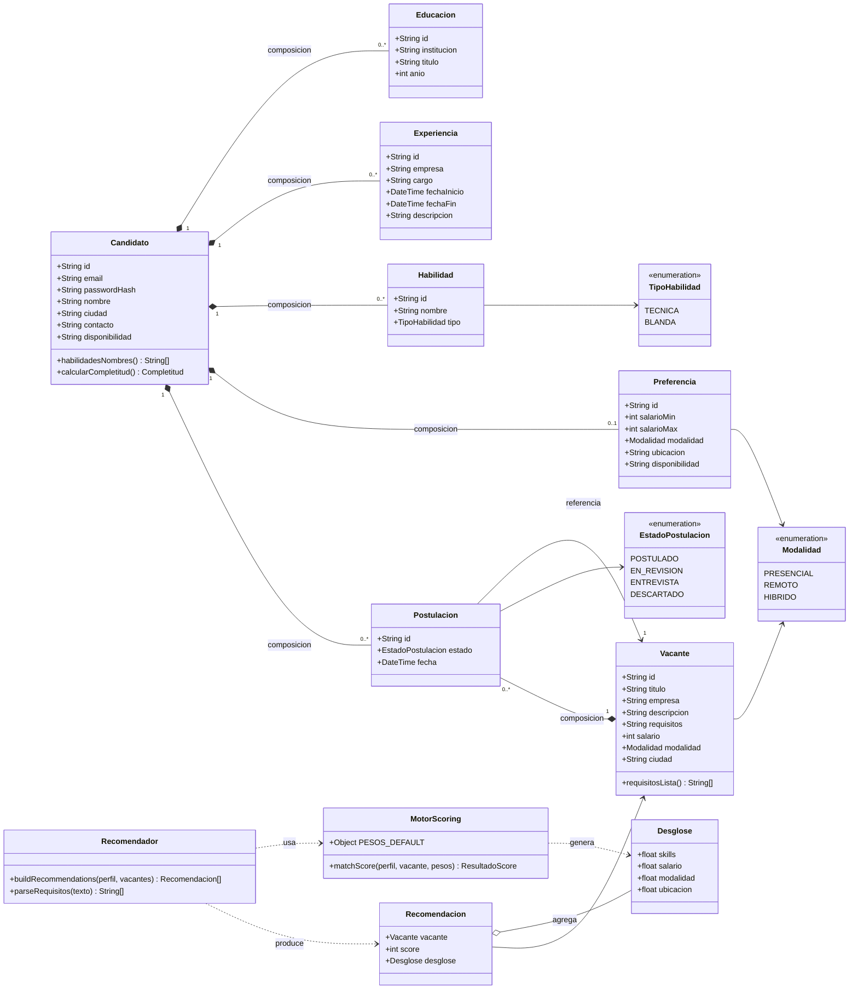
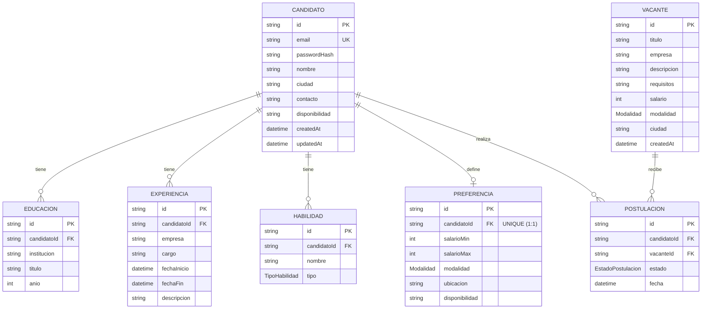
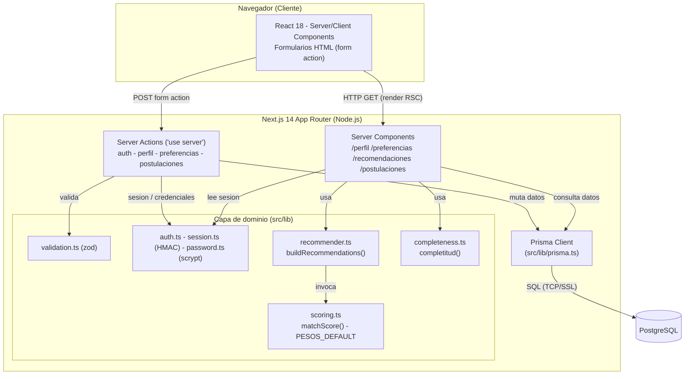
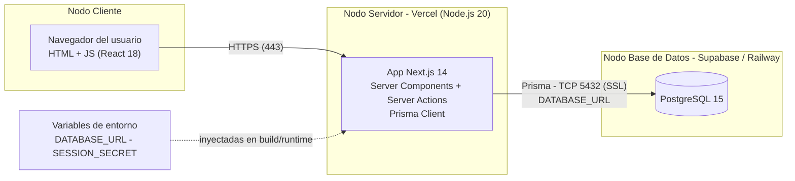

# Diagramas de Arquitectura - SkillNav (Entrega 2)

Los 4 diagramas de arquitectura requeridos por la Entrega 2.
Renderizados automaticamente por GitHub (Mermaid).

# Diagramas de Arquitectura - SkillNav (Entrega 2)

Los 4 diagramas reflejan la **arquitectura real** del repositorio
[Smonto-06/skillnav](https://github.com/Smonto-06/skillnav), inspeccionado en el commit
base `3e8a5d8` (`feat(E1-E8): implementar nucleo del 60% de SkillNav`).

Stack real verificado en el código: **Next.js 14.2.5 (App Router) + TypeScript + React 18 +
Tailwind 3 + Prisma 5.20 + PostgreSQL + Zod**. Nota de arquitectura importante: el repo **no
usa Route Handlers/API REST** para el flujo principal; las lecturas se hacen en **Server
Components** (Prisma directo) y las mutaciones en **Server Actions** (`"use server"`). La sesión
es una **cookie firmada con HMAC-SHA256** (`session.ts`) y las contraseñas se guardan con
**scrypt** (`password.ts`). El scoring vive en `src/lib/scoring.ts` (`matchScore`, `PESOS_DEFAULT`)
y el recomendador en `src/lib/recommender.ts` (`buildRecommendations`, `parseRequisitos`).

---

## Diagrama 1 - Diagrama de Clases de Diseño

Visión orientada a objetos del dominio (no es el modelo de BD). Incluye las entidades del perfil,
las vacantes y postulaciones, y la capa de servicio de recomendación/scoring tal como está
implementada. Métodos derivados de funciones reales del código (`matchScore`, `buildRecommendations`,
`parseRequisitos`, `completitud`).

---

## Diagrama 2 - Diagrama Entidad-Relación (ER)

Mapeo fiel de `prisma/schema.prisma`: entidades, atributos con tipos, PK/FK/UK y cardinalidades.
`Preferencia` es 1:1 con `Candidato` (`candidatoId` es `@unique`); el resto de relaciones son 1:N.
Todas las FK hacia `Candidato` tienen `onDelete: Cascade`.

---

## Diagrama 3 - Diagrama de Componentes

Componentes reales y sus interfaces. El cliente (navegador) habla con el servidor Next.js por dos
vías: **render de Server Components** (HTTP GET) y **Server Actions** vía `form action` (POST). La
capa de dominio en `src/lib` concentra validación (zod), sesión/seguridad (HMAC + scrypt), scoring
y recomendación; el acceso a datos es exclusivo de **Prisma Client**, que habla SQL con PostgreSQL.

---

## Diagrama 4 - Diagrama de Despliegue

Topología de producción **objetivo/recomendada** para la Entrega 2. Nota honesta: el repo en el
commit base **no incluye todavía manifiestos de despliegue** (`vercel.json`, IaC); esta es la
topología propuesta coherente con el stack (server Next.js en Vercel, PostgreSQL gestionado en
Supabase o Railway). El servidor Node.js renderiza RSC y ejecuta Server Actions, y se conecta a la
BD por Prisma sobre TCP/SSL usando `DATABASE_URL`.

---

### Coherencia cruzada

- Las entidades del ER (Candidato, Educacion, Experiencia, Habilidad, Preferencia, Vacante,
  Postulacion) aparecen como clases en el Diagrama 1, con los mismos enums (`TipoHabilidad`,
  `Modalidad`, `EstadoPostulacion`).
- Los componentes del Diagrama 3 (`scoring.ts`, `recommender.ts`, `auth/session/password`,
  Prisma) coinciden con las clases de servicio del Diagrama 1 (`MotorScoring`, `Recomendador`) y
  con los nodos del Diagrama 4.
- Fuente única de verdad: código real del repo en el commit `3e8a5d8`.
